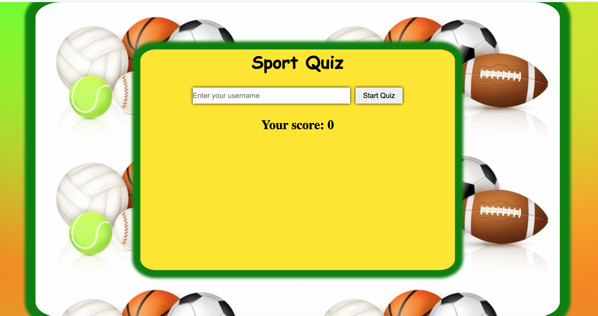
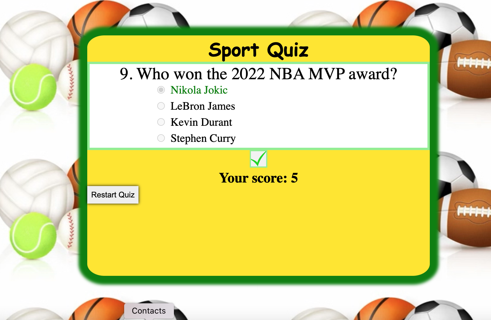
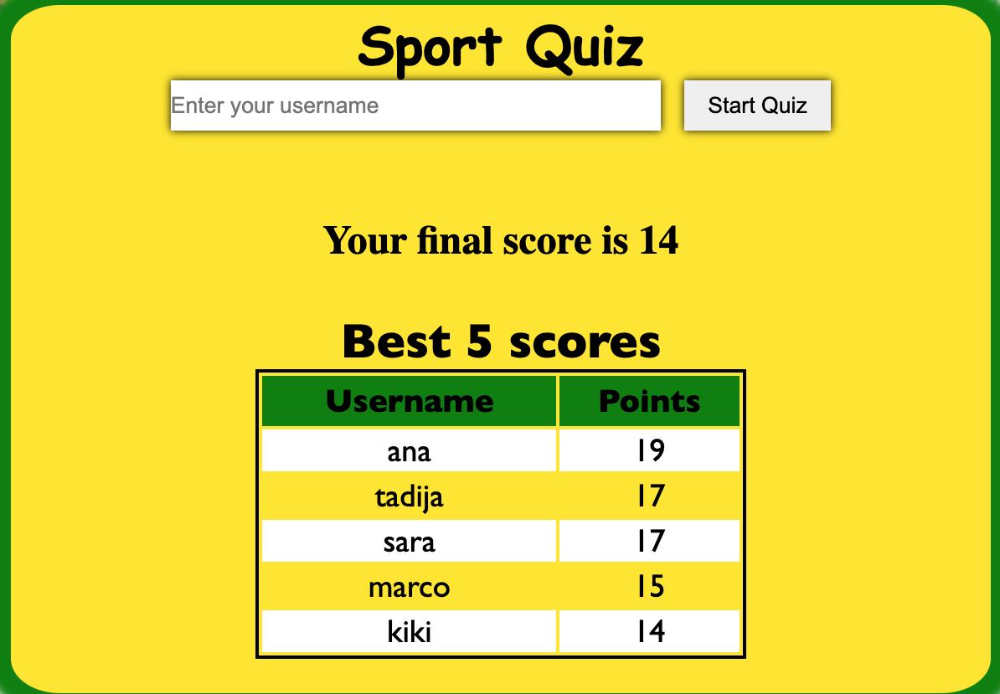
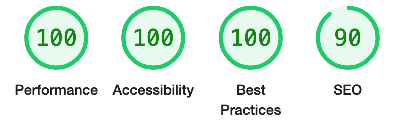

#                          SPORT QUIZ

Sports quizzes allow individuals to test their knowledge and recall information about their favorite sports, athletes, historical facts. Quizzes can increase engagement among sports fans, encouraging interaction and discussion about sports topics.

The primary purpose of this site is to combine enjoyment with learning and social interaction, making it a popular activity among sports enthusiasts.

## Features

Existing Features

  ▪︎ Header
    
    ▫︎ The header shows the name of the quiz and clearly tells the user
      what kind of quiz they are playing.

    

  ▪︎ The Quiz Questions

    ▫︎ This section includes multiple choice random questions.

    ▫︎ The answers are interactive buttons that the user can click to make their choice.

  

  ▪︎ Score Section

    ▫︎ The JavaScript code updating the score and the user can see clearly the final score.

    ▫︎ There is a restart button to play the quiz from beginning. 

    ▫︎ This section includes tracking score system, the table is showing the 5 best scores.

  

Potential Features

  ▪︎ I could improve the quiz with points system for unlocking new content.

  ▪︎ I would like also to support different languages.

  ## Testing

  ▪︎ I confirmed that this project is responsive and it is working on all standard screen sizes.

  ▪︎ It is confirmed through the lighthouse in devtools that colors and fonts are easy to read and accessible.

  

#### Validator Testing

  ▪︎ HTML

    ▫︎ There were no errors or warnings when passing through official W3C HTML Validator.

  ▪︎ CSS 

    ▫︎ There were no errors when passing through official W3C CSS Validator.

  ▪︎ JavaScript

    ▫︎ There were no errors when passing through official JSHint JavaScript Validator. 

#### Bugs

Solved bugs

  ▪︎  When I deployed the quiz to GitHub pages I noticed that the background image did not work because I used absolute file path. 

  ▪︎ I removed "/" and the issue was fixed.

Unfixed Bugs

  ▪︎ There is no unfixed bugs.

